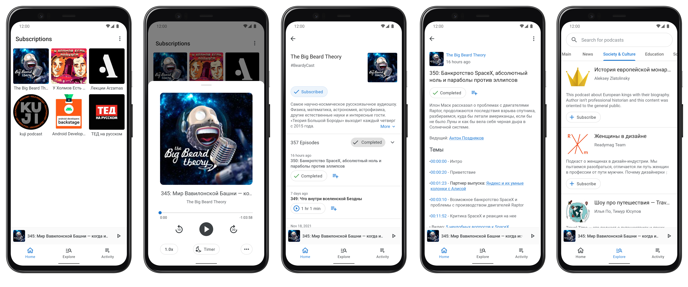
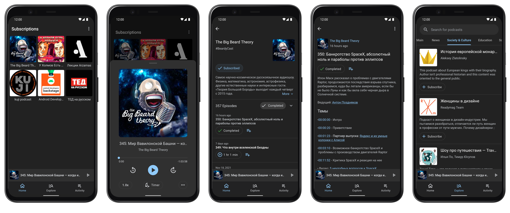

# Podcasts
Android podcast app based on [ListenAPI](https://www.listennotes.com/api/).




## Warning
* Since ListenAPI services were blocked by Roskomnadzor, the playback of episodes may not work in Russia. 
However, all the rest functionality based on ListenAPI still works.
* Android 12 is currently not supported because some dependencies did not meet the new PendingIntent requirements. 
Updating these dependencies fixes crushes on Android 12, but breaks in-app navigation and splash screen (maybe something else, but these were noticed).

## Supported features
* You can search for podcasts, subscribe to them and listen to their episodes.
* Curated lists of the best podcasts by genre.
* Background playback with media notification that allows the user to pause, resume and rewind forward and backward for a certain amount of seconds.
* The progress of each episode is maintained and also visually described. This allows the user to resume the playback of any previous episode at any time.
The user also can mark any episode as completed or reset its progress.
* Changing the sorting of the episode list and hiding the completed ones.
* Clickable timestamps (which follow the conventional pattern).
* Changing the playback speed.
* Sleep timer.
* Dark theme.

## Not supported features
* Playlists and autoplay are not supported. You can use Bookmarks as a workaround to mark episodes you want to listen to in future.
* Downloading episodes for offline playback is not supported.
* Headphone buttons are not working due to some imperfections of ExoPlayer Media2 extension. Media2 should handle these buttons by itself, but
it does not when working with ExoPlayer.
* Seeking with a progress bar within a media notification is not working for the same reason as headphone buttons.

## Architecture
The app uses single activity architecture with Jetpack Navigation. 

Retrofit and Moshi are used for interacting with ListenAPI service. The received data is stored in the database using Room. 
Then Room DAOs expose the data via Kotlin Flows to the repository layer which in turn all app's ViewModels depend on. 
The app actively uses Flow intermediate operators for data transformation. Jetpack DataStore is used for storage settings-related data.

Hilt is used as a DI framework.

Jetpack Media2 in conjunction with ExoPlayer is used for background media playback. The app uses the ```PlayerServiceConnection``` class to connect and
interact with the ```PlayerService```. The ```PlayerServiceConnection``` contains a Media2 ```MediaController``` that exposes player-related data via Flows.
All app's ViewModels that need to access player-related data depend on this class. Since some Media2 ```MediaController``` features does not work with
ExoPlayer Media2 extension, some player data is passed directly from the ExoPlayer instance stored within the ```PlayerService``` through the ```PlayerServiceBinder```.
Then ```MainActivity```, which ```PlayerService``` is bound to, receive this data and pass it to the ```PlayerServiceConnection```.
```MediaControlReceiver``` is a ```BroadcastReceiver``` that handles media notification buttons.

On UI level the app actively uses Material components, RecyclerView, SwipeRefreshLayout, ViewPager2, Dialogs and Material motion system for creating navigation
and container animations. Coil library is used for loading images. App's ViewModels use Kotlin ```sealed``` classes for presenting UI states and UI events.
